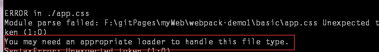

## webpack
原文 摘自与 慕课网的 [快速入门 webpack](http://www.imooc.com/article/10965)

查找资料，总结成笔记，对于大牛来说webpack简单易懂容易上手，但是对我这个小菜鸟来说，还需一番折腾与实践，已经看了数日，但是似乎没有捋顺其中的逻辑，所以写此文来细细琢磨一番！

### 什么是webpack
> webpack就是一个模块打包工具，处理模块之间的依赖，同时生成对应模块的静态资源

#### 要点：
- webpack 把项目中的所有资源看做是一个模块
- 模块之间存在这一系列的依赖
- 打包之后生成多个静态文件，涉及到代码拆分，提取，合并

### webpack安装与配置
#### 安装
为了加快安装的速度，可以先安装淘宝镜像
npm install -g cnpm --registry=https://registry.npm.taobao.org

- 全局安装（以便全局调用：如webpack --config webpack.config.js）

		npm install -g webpack
- 项目本地安装

		npm install webpack (--save-dev 加不加即可,加上--save-dev会将配置写在package.json里如果不加直接安装在本地，不会写入package.json)
		// 本地安装是为了方便调用
		方式一：es6 语法
		import webpack from "webpack"
		方式二：es5 语法
		var webpack = require("webpack")

### webpack的基本配置

- 创建配置文件（webpack.config.js）,执行webpack命令的时候，默认会执行这个文件

``` bash
	module.export = {
		entry: "app.js", // 入口文件
		output: {
			path: 'assets/', // 输出文件所在的目录
			filename: '[name].bundle.js'	// 输出文件名，name是入口文件定义的名字 输出文件夹是app.bundle.js
			---------不确定
		}，
		module： {
			loaders:[
				// 使用babel-loader解析js或者jsx模块
				{test:/\.js\.jsx%/, loader: 'babel'}，
				// 使用css-loader解析css模块
				{test:/\.css$/, loader:'style!css'}
			]
		}

	}
```
解析css另一种写法是：{test:/\.css$/, loader:['style', 'css']}

### 一个简单的例子
**以下是我实践过的例子，并标注了容易出错的地方**

目录结构是这样的：
- index.html
- basic
	- assets
	- node_modules
	- app.js
	- app.css
	- package.json
	- webpack.config.js


webpack.config.js
``` bash
	module.exports = {
	    // 如果你有多个入口js文件，需要打包在一个文件夹中，这样写：
	    // entry: ['./app1.js', './app2.js']
	    entry:'./app.js',
	    output:{
	        path:'./assets',
	        filename:'[name].bundle.js'
	    },
	    module:{
	        loaders :[ // 注意是loaders 不要少了s
	            {test:/\.js$/, loader:'babel'}, // 注意是test不是text
	            {test:/\.css$/,loader:'style!css'}
	        ]
	    }
	};
```


 如果关键字写错，会报这个错误


app.js

``` bash
	require('./app.css');
	document.getElementById('container').textContent = "App";
```

app.css

``` bash
	* {
	    margin: 0;
	    padding: 0;
	}

	#container {
	    margin: 50px auto;
	    width: 50%;
	    height: 200px;
	    line-height: 200px;
	    border-radius: 5px;
	    box-shadow: 0 0 .5em #000;
	    text-align: center;
	    font-size: 40px;
	    font-weight: bold;
	}
```

index.html

``` bash
	<!DOCTYPE html>
	<html lang="en">
	<head>
	    <meta charset="UTF-8">
	    <title>Title</title>
	</head>
	<body>
	    <div id="container"></div>
	    <script src="./basic/assets/main.bundle.js"></script>
	</body>
	</html>
```

>需要注意的问题：
>1. 要安装的模块有 css-loader, style-loader, babel-loader, babel-core
>2. webpack.config.js要和node_modules同级


